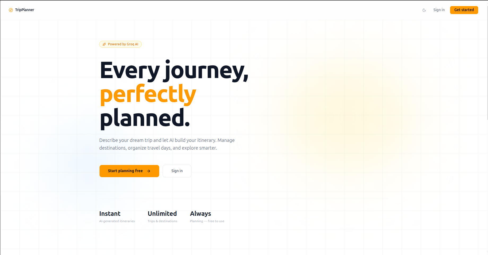
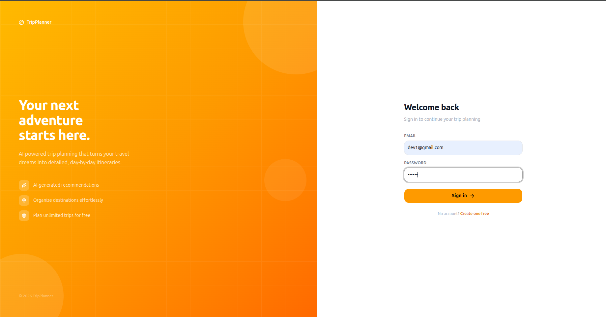
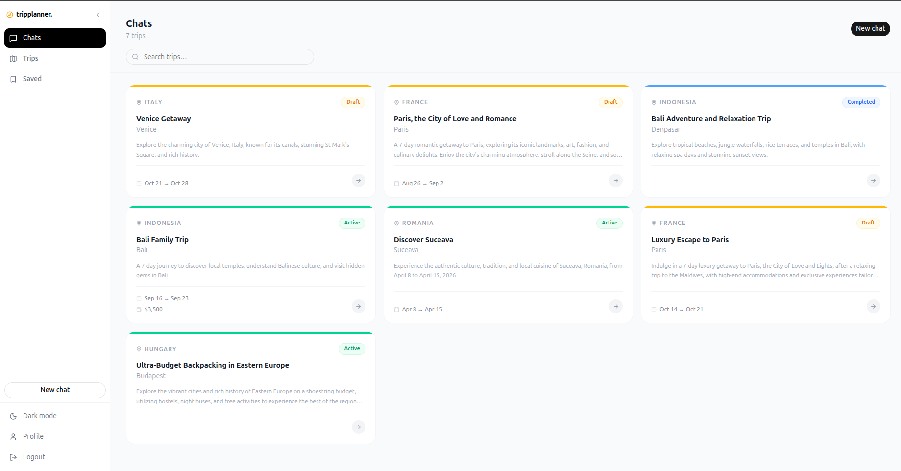
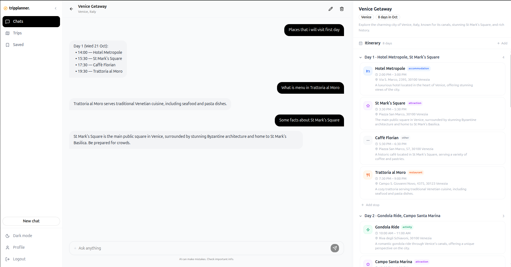
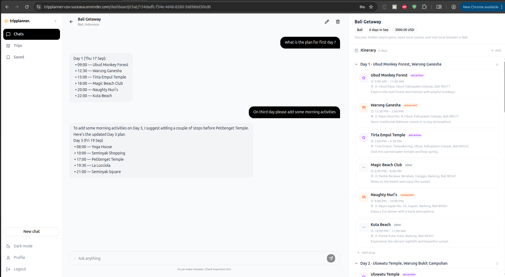
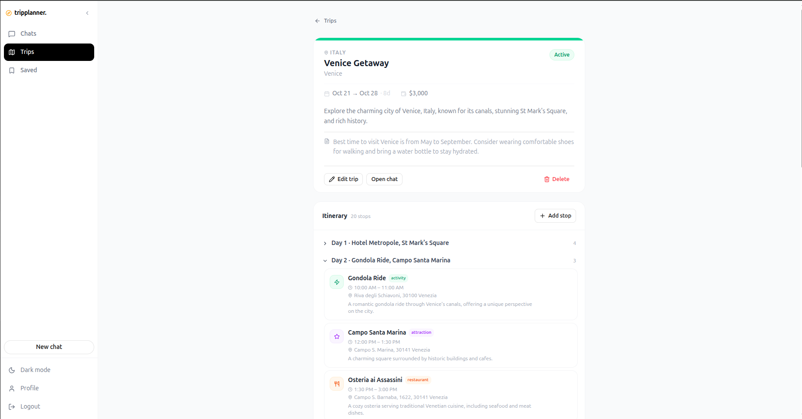
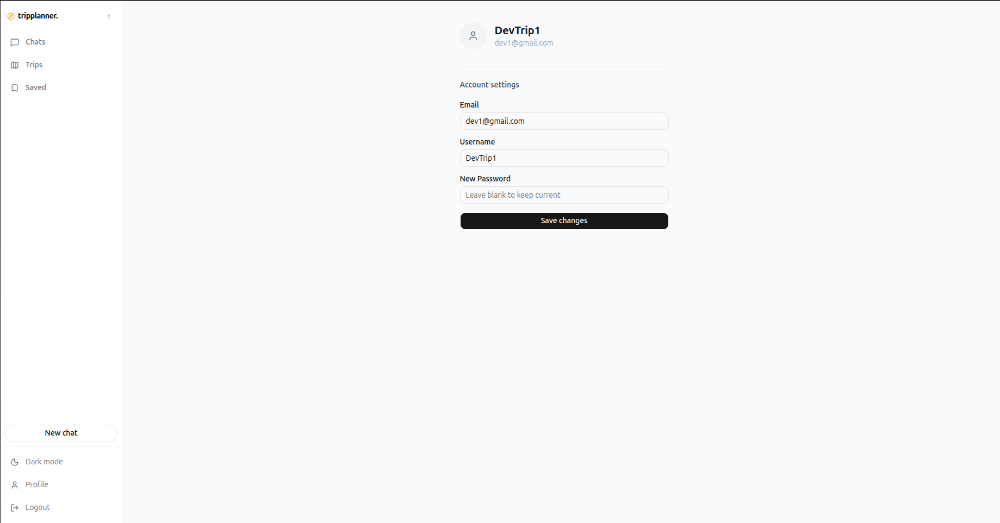

# Raport de Proiect — TripPlanner

---

**Universitatea Ștefan cel Mare din Suceava**
**Facultatea de Calculatoare, Informatică și Microelectronică**

---

Disciplina: Tehnologii Web Avansate
Student: Saveliev Maxim
Suceava, 2026

---

## Cuprins

1. [Despre aplicație](#1-despre-aplicație)
2. [Cum funcționează](#2-cum-funcționează)
3. [Implementarea tehnică](#3-implementarea-tehnică)
4. [Capturi de ecran](#4-capturi-de-ecran)
5. [Aplicația live](#5-aplicația-live)
6. [Acces demo](#6-acces-demo)
7. [Concluzie](#7-concluzie)

---

## 1. Despre aplicație

**TripPlanner** este o aplicație web de planificare a călătoriilor alimentată de inteligență artificială. Scopul aplicației este de a simplifica procesul de organizare a unei excursii — utilizatorul descrie destinația, datele și bugetul în limbaj natural, iar sistemul generează automat un itinerar detaliat zi cu zi, complet cu hoteluri, restaurante, atracții și activități.

### Funcționalități principale

| Funcționalitate | Descriere |
|---|---|
| Generare itinerar cu AI | Utilizatorul furnizează destinația, intervalul de date și bugetul; modelul LLM Groq generează un plan structurat pe zile cu opriri, ore și adrese |
| Chat conversațional | Utilizatorul poate rafina itinerarul prin conversație directă cu AI-ul — pune întrebări, solicită alternative sau schimbă locații |
| Panou itinerar live | Itinerarul se actualizează în timp real alături de chat; fiecare oprire afișează categorie, interval orar, adresă și descriere |
| Gestionare călătorii | Creare, editare și ștergere călătorii; statusuri: Ciornă / Activ / Finalizat |
| Elemente salvate | Marcarea opririle interesante din orice călătorie |
| Adaugă/elimină opriri | Manual sau prin instrucțiuni AI |
| Mod întunecat | Comutator complet luminos/întunecat, persistent între sesiuni |
| Autentificare | Înregistrare și autentificare bazate pe JWT; setări profil |

---

## 2. Cum funcționează

### Fluxul utilizatorului

```
1. Utilizatorul se înregistrează sau se autentifică
        │
        ▼
2. Creează un chat nou → descrie călătoria (destinație, date, buget)
        │
        ▼
3. AI-ul (Groq LLM) generează itinerarul complet zi cu zi
        │
        ▼
4. Itinerarul apare în panoul din dreapta cu toate opririle
        │
        ▼
5. Utilizatorul continuă conversația pentru a rafina planul
   (ex: "Adaugă activități de dimineață în ziua 3")
        │
        ▼
6. AI-ul modifică automat itinerarul și răspunde în chat
        │
        ▼
7. Utilizatorul poate vedea și edita manual călătoria
   din secțiunea "Trips"
```

### Arhitectura sistemului

```
Browser (Next.js Frontend)
  │
  │  HTTP REST (Axios)  ← NEXT_PUBLIC_API_URL
  ▼
FastAPI Backend  ──────────────────────────────────┐
  │                                                │
  │  SQLAlchemy / asyncpg                          │  Groq SDK
  │  DATABASE_URL                                  │  GROQ_API_KEY
  ▼                                                ▼
PostgreSQL                               Groq LLM API (extern)
```

Comunicarea dintre frontend și backend se face exclusiv prin REST API. Frontend-ul este un server Next.js standalone care face apeluri HTTP autentificate cu JWT. Backend-ul validează token-ul la fiecare cerere protejată și servește sau modifică datele din baza de date PostgreSQL. Apelurile către AI se fac din backend — frontnd-ul nu contactează niciodată direct Groq.

---

## 3. Implementarea tehnică

### 3.1 Stiva tehnologică

**Frontend**
- Next.js 16 (App Router, output standalone)
- React 19, TypeScript
- Tailwind CSS v4, shadcn/ui
- Axios, next-themes, Lucide React

**Backend**
- Python 3, FastAPI
- SQLAlchemy 2 (async ORM), Alembic (migrări)
- asyncpg (driver PostgreSQL async)
- Groq SDK (inferență LLM)
- PyJWT + passlib/bcrypt (autentificare)
- Pydantic v2 (validare), Uvicorn (server ASGI)

**Bază de date**
- PostgreSQL

**Hosting**
- Render.com (backend + frontend + PostgreSQL gestionat)

---

### 3.2 Structura proiectului backend

```
backend/
├── app/
│   ├── main.py            # punctul de intrare FastAPI, CORS, lifespan
│   ├── config.py          # variabile de mediu (Pydantic Settings)
│   ├── database.py        # engine async SQLAlchemy, sesiune DB
│   ├── dependencies.py    # dependențe reutilizabile (auth, ownership)
│   ├── models/            # modele SQLAlchemy (tabele DB)
│   │   ├── user.py
│   │   ├── trip.py
│   │   ├── destination.py
│   │   ├── message.py
│   │   └── saved_place.py
│   ├── schemas/           # scheme Pydantic (validare input/output)
│   ├── routers/           # endpoint-uri grupate pe domeniu
│   │   ├── auth.py
│   │   ├── trips.py
│   │   ├── destinations.py
│   │   ├── ai.py
│   │   └── saved.py
│   └── services/          # logica de business
├── alembic/               # migrări bază de date
└── requirements.txt
```

---

### 3.3 Crearea API-ului cu FastAPI

#### Inițializarea aplicației

```python
# app/main.py
from fastapi import FastAPI
from fastapi.middleware.cors import CORSMiddleware

@asynccontextmanager
async def lifespan(app: FastAPI):
    async with engine.begin() as conn:
        await conn.run_sync(Base.metadata.create_all)
    yield

app = FastAPI(title="Trip Planner API", lifespan=lifespan)

app.add_middleware(
    CORSMiddleware,
    allow_origins=[settings.frontend_url, "http://localhost:3000"],
    allow_credentials=True,
    allow_methods=["*"],
    allow_headers=["*"],
)

for router in (auth.router, trips.router, destinations.router, ai.router, saved.router):
    app.include_router(router)
```

Aplicația folosește **lifespan context manager** pentru a inițializa tabelele la pornire. **CORS Middleware** restricționează originile acceptate la domeniul frontend-ului. Router-ele sunt înregistrate centralizat în buclă.

---

#### Modelele de date (SQLAlchemy 2)

Aplicația are 4 tabele principale:

**`users`** — conturi utilizatori
```python
class User(Base):
    __tablename__ = "users"
    id: Mapped[uuid.UUID] = mapped_column(primary_key=True, default=uuid.uuid4)
    email: Mapped[str] = mapped_column(String, unique=True, nullable=False)
    username: Mapped[str] = mapped_column(String, nullable=False)
    password_hash: Mapped[str] = mapped_column(String, nullable=False)
    created_at: Mapped[datetime] = mapped_column(DateTime(timezone=True), ...)
```

**`trips`** — călătorii ale utilizatorilor, cu status enum (draft/active/completed/cancelled), buget, valută, date de start/end și relație one-to-many cu `destinations`.

**`destinations`** — opririle din itinerar (hotel, restaurant, atracție etc.), cu câmpuri: `visit_date`, `visit_time`, `duration_minutes`, `order_index`, `category`, `address`.

**`messages`** — istoricul conversației AI per călătorie (rol: user/assistant).

---

#### Autentificarea JWT

```python
# routers/auth.py
router = APIRouter(prefix="/api/auth", tags=["auth"])

@router.post("/register", response_model=UserResponse, status_code=201)
async def register(body: RegisterRequest, db: AsyncSession = Depends(get_db)):
    if await _email_taken(db, body.email):
        raise HTTPException(400, "Email already registered")
    user = User(
        email=body.email,
        username=body.username,
        password_hash=hash_password(body.password),  # bcrypt
    )
    db.add(user)
    await db.commit()
    return user

@router.post("/login", response_model=TokenResponse)
async def login(body: LoginRequest, db: AsyncSession = Depends(get_db)):
    user = await db.scalar(select(User).where(User.email == body.email))
    if not user or not verify_password(body.password, user.password_hash):
        raise HTTPException(401, "Invalid credentials")
    return {"access_token": create_token(user.id)}  # PyJWT
```

Parola este hash-uită cu **bcrypt** prin passlib. Token-ul JWT este semnat cu `SECRET_KEY` și conține `user_id`. La fiecare cerere protejată, dependența `get_current_user` extrage și validează token-ul din header-ul `Authorization: Bearer`.

---

#### Router-ul pentru călătorii (CRUD complet)

```python
# routers/trips.py
router = APIRouter(prefix="/api/trips", tags=["trips"])

@router.get("")            # listare cu filtrare, căutare, paginare
@router.post("")           # creare
@router.get("/{trip_id}")  # detalii
@router.put("/{trip_id}")  # înlocuire completă
@router.patch("/{trip_id}")# actualizare parțială
@router.delete("/{trip_id}")# ștergere
```

Dependența `get_owned_trip` verifică automat că trip-ul există **și** aparține utilizatorului autentificat, eliminând duplicarea acestei logici din fiecare endpoint.

---

#### Router-ul pentru destinații (opriri itinerar)

```
GET    /api/trips/{trip_id}/destinations         # listare opriri
POST   /api/trips/{trip_id}/destinations         # adaugă oprire
PATCH  /api/trips/{trip_id}/destinations/reorder # reordonare drag-and-drop
GET    /api/trips/{trip_id}/destinations/{id}    # detalii oprire
PUT    /api/trips/{trip_id}/destinations/{id}    # înlocuire
PATCH  /api/trips/{trip_id}/destinations/{id}    # actualizare parțială
DELETE /api/trips/{trip_id}/destinations/{id}    # ștergere
```

Endpoint-ul `/reorder` primește o listă de `{id, order_index}` și actualizează ordinea tuturor opririle printr-o singură tranzacție — necesar pentru funcționalitatea drag-and-drop din frontend.

---

#### Integrarea cu AI (Groq LLM)

```python
# routers/ai.py
router = APIRouter(prefix="/api/ai", tags=["ai"])

@router.post("/plan")
async def generate_plan(body: PlanRequest, ...):
    # generează itinerarul inițial
    return await ai_service.generate_plan(
        destination=body.destination,
        start_date=body.start_date,
        end_date=body.end_date,
        budget=body.budget,
        interests=body.interests,
    )

@router.post("/chat", response_model=ChatResponse)
async def chat(body: ChatRequest, ...):
    # chat conversațional cu modificare automată a itinerarului
    result = await ai_service.smart_chat(history, trip=trip, destinations=destinations)
    
    if result.get("modifications"):
        await _apply_modifications(db, body.trip_id, result["modifications"])
    
    # salvează mesajele în DB
    db.add(ChatMessageModel(role=MessageRole.assistant, content=result["reply"]))
    await db.commit()
    return {"reply": result["reply"], "trip_updated": trip_updated}
```

Endpoint-ul `/chat` este cel mai complex: trimite istoricul conversației și itinerarul curent către Groq, primește răspunsul AI care poate conține `modifications` (adăugare/actualizare/ștergere opriri), aplică modificările în baza de date și returnează răspunsul textual alături de un flag `trip_updated` — pe care frontend-ul îl folosește pentru a reîncărca panoul de itinerar în timp real.

Structura `modifications` pe care AI-ul o returnează:
```json
{
  "reply": "Am adăugat activități de dimineață în ziua 3.",
  "modifications": {
    "add_destinations": [...],
    "update_destinations": [...],
    "delete_destination_ids": [...]
  }
}
```

---

#### Endpoint de health check

```python
@app.get("/api/health")
async def health():
    return {"status": "ok"}
```

Folosit de servicii externe (cron-job.org) pentru a menține backend-ul activ pe planul gratuit Render.

---

#### Tabelul complet al endpoint-urilor API

| Metodă | Endpoint | Descriere | Auth |
|---|---|---|---|
| POST | `/api/auth/register` | Creare cont | Nu |
| POST | `/api/auth/login` | Autentificare, returnează JWT | Nu |
| GET | `/api/auth/me` | Profilul utilizatorului curent | Da |
| PATCH | `/api/auth/me` | Actualizare profil | Da |
| GET | `/api/trips` | Listare călătorii (filtrare, căutare, paginare) | Da |
| POST | `/api/trips` | Creare călătorie nouă | Da |
| GET | `/api/trips/{id}` | Detalii călătorie | Da |
| PUT | `/api/trips/{id}` | Înlocuire completă călătorie | Da |
| PATCH | `/api/trips/{id}` | Actualizare parțială călătorie | Da |
| DELETE | `/api/trips/{id}` | Ștergere călătorie | Da |
| GET | `/api/trips/{id}/destinations` | Listare opriri itinerar | Da |
| POST | `/api/trips/{id}/destinations` | Adaugă oprire | Da |
| PATCH | `/api/trips/{id}/destinations/reorder` | Reordonare opriri | Da |
| GET | `/api/trips/{id}/destinations/{did}` | Detalii oprire | Da |
| PUT | `/api/trips/{id}/destinations/{did}` | Înlocuire oprire | Da |
| PATCH | `/api/trips/{id}/destinations/{did}` | Actualizare parțială oprire | Da |
| DELETE | `/api/trips/{id}/destinations/{did}` | Ștergere oprire | Da |
| POST | `/api/ai/plan` | Generare itinerar inițial | Da |
| POST | `/api/ai/chat` | Chat AI cu modificare itinerar | Da |
| GET | `/api/ai/messages/{trip_id}` | Istoricul conversației | Da |
| POST | `/api/ai/update-trip/{trip_id}` | Actualizare trip prin instrucțiune | Da |
| GET | `/api/saved` | Elemente salvate | Da |
| POST | `/api/saved` | Salvare element | Da |
| PATCH | `/api/saved/{id}` | Actualizare element salvat | Da |
| DELETE | `/api/saved/{id}` | Ștergere element salvat | Da |
| GET | `/api/health` | Health check | Nu |

---

## 4. Capturi de ecran

### Pagina principală


### Autentificare


### Tabloul de bord — călătorii


### Chat AI — Veneția


### Chat AI — Bali


### Detalii călătorie și itinerariu


### Setări profil


---

## 5. Aplicația live

Aplicația este găzduită pe platforma [Render.com](https://render.com) și este accesibilă la:

**[https://tripplanner-usv-suceava.onrender.com](https://tripplanner-usv-suceava.onrender.com)**

<p align="center">
  
</p>

> **Notă:** Aplicația rulează pe planul gratuit Render. La prima accesare după o perioadă de inactivitate, serviciile pot necesita ~30 de secunde pentru a porni.

Documentația interactivă a API-ului backend este disponibilă la:
**[https://tripplanner-api-nhb0.onrender.com/docs](https://tripplanner-api-nhb0.onrender.com/docs)**

---

## 6. Acces demo

Pentru a explora aplicația cu date existente, se poate folosi contul de test:

| Câmp | Valoare |
|---|---|
| **URL** | https://tripplanner-usv-suceava.onrender.com |
| **Email** | `dev1@gmail.com` |
| **Parolă** | `Qwerty123` |

Contul conține mai multe călătorii create (Veneția, Paris, Bali, Suceava etc.) cu itinerare complete generate de AI, gata pentru a fi explorate.

---

## 7. Concluzie

TripPlanner demonstrează integrarea unui model de limbaj mare (LLM) într-o aplicație web full-stack funcțională. Principalele realizări tehnice ale proiectului:

- **API REST complet** construit cu FastAPI, cu autentificare JWT, validare Pydantic și acces asincron la baza de date prin SQLAlchemy 2 + asyncpg
- **Integrare AI conversațională** — AI-ul nu doar răspunde, ci și modifică structura de date din baza de date în timp real, pe baza instrucțiunilor utilizatorului
- **Arhitectură clară pe straturi** — routers → services → models, cu dependențe reutilizabile și separare netă a responsabilităților
- **Frontend modern** cu Next.js 16, React 19 și Tailwind CSS, cu actualizare live a itinerarului și suport complet pentru mod întunecat
- **Deployment în producție** pe Render.com cu bază de date PostgreSQL gestionată

Proiectul reprezintă o aplicație completă, de la autentificare și gestionare date până la generare de conținut prin AI și deployment în cloud.
